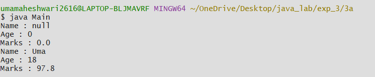
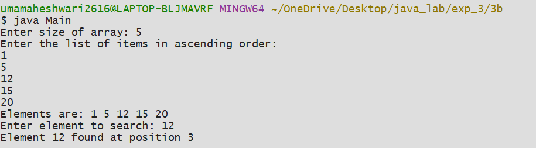
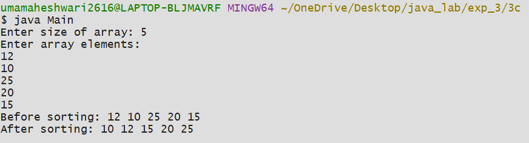

# Experiment-3
## 3a) Title: Implement constructor oveloading in JAVA
### Source Code
```java
class Student {

    String name;
    int age;
    double marks;

    Student() {
    }
    Student(String name, int age, double marks) {
        this.name = name;
        this.age = age;
        this.marks = marks;
    }
    void display() {
        System.out.println("Name : " + name);
        System.out.println("Age : " + age);
        System.out.println("Marks : " + marks);
    }
}

class Main {

    public static void main(String args[]) {

        Student std = new Student();
        std.display();

        Student std1 = new Student("Uma", 19, 87.8);
        std1.display();
    }
}
```
## output :


## exp3b) Title: Binary Search 
## Source Code:
```java
import java.util.Scanner;

class BinarySearch {
    int list[];
    int size;

    BinarySearch(int size) {
        this.size = size;
        list = new int[size];
    }

    void setList() {
        Scanner sc = new Scanner(System.in);
        System.out.println("Enter the list of items in ascending order:");
        for (int i = 0; i < size; i++) {
            list[i] = sc.nextInt();
        }
    }

    void getList() {
        for (int i = 0; i < size; i++) {
            System.out.print(list[i] + " ");
        }
        System.out.println();
    }

    int binarySearch(int key) {
        int low = 0;
        int high = list.length - 1;

        while (low <= high) {  
            int mid = (low + high) / 2;

            if (list[mid] == key)
                return mid + 1;
            else if (list[mid] < key)
                low = mid + 1;
            else
                high = mid - 1;
        }
        return -1;
    }
}
import java.util.Scanner;

class Main {
    public static void main(String args[]) {
        Scanner sc = new Scanner(System.in);

        System.out.print("Enter size of array: ");
        int n = sc.nextInt();

        BinarySearch bs = new BinarySearch(n);

        bs.setList();

        System.out.print("Elements are: ");
        bs.getList();

        System.out.print("Enter element to search: ");
        int key = sc.nextInt();

        int index = bs.binarySearch(key);

        if (index == -1)
            System.out.println("Element " + key + " not found in the list");
        else
            System.out.println("Element " + key + " found at position " + index);

        sc.close(); 
    }
}
```
# Output:


## exp3c) Title: Bubble Sort 
## Source Code:
```java
import java.util.Scanner;

class BubbleSort {
    int arr[];
    int size;

    BubbleSort(int size) {
        this.size = size;
        arr = new int[size];
    }

    void setArray() {
        Scanner sc = new Scanner(System.in);
        System.out.println("Enter array elements:");
        for (int i = 0; i < size; i++) {
            arr[i] = sc.nextInt();
        }
    }

    void sort() {
        int temp;
        for (int i = 0; i < size - 1; i++) {
            for (int j = 0; j < size - 1 - i; j++) {
                if (arr[j] > arr[j + 1]) {
                    temp = arr[j];
                    arr[j] = arr[j + 1];
                    arr[j + 1] = temp;
                }
            }
        }
    }
    void display() {
        for (int i = 0; i < size; i++) {
            System.out.print(arr[i] + " ");
        }
        System.out.println();
    }
}
class Main {

    public static void main(String args[]) {

        Scanner sc = new Scanner(System.in);
        System.out.print("Enter size of array: ");
        int n = sc.nextInt();
        BubbleSort bs = new BubbleSort(n);
        bs.setArray();
        System.out.print("Before sorting: ");
        bs.display();
        bs.sort();
        System.out.print("After sorting: ");
        bs.display();
    }
}
```
# Output:



